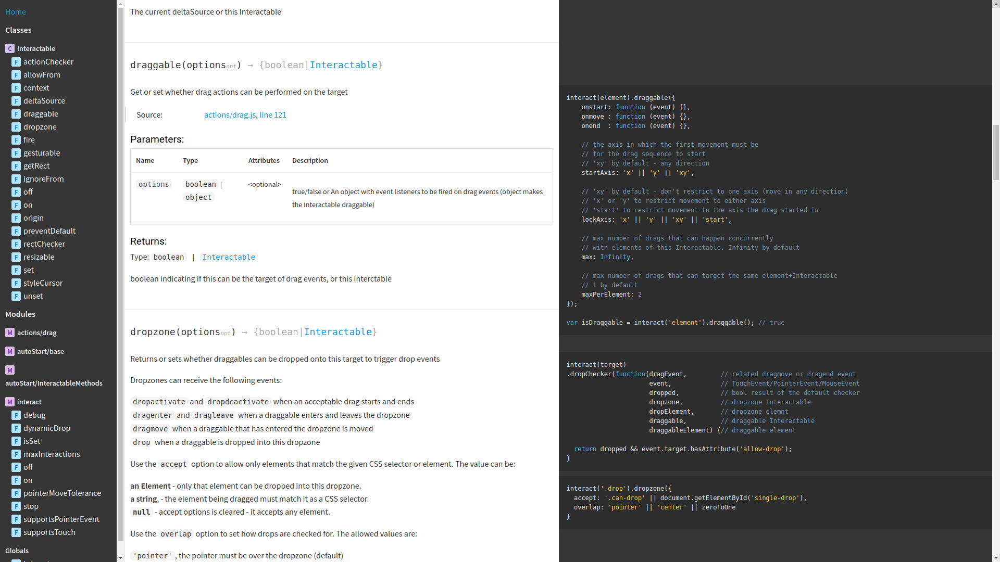

# jsdoc-stale

A clean, responsive documentation template theme for JSDoc 3 inspired by
[slate](https://github.com/lord/slate) and based on
[minami](https://github.com/nijikokun/minami).




## Install

With npm:

```sh
$ npm install --save-dev jsdoc git+https://git@github.com/taye/jsdoc-stale
```

## configure jsdoc

In your `.jsdoc.json` file, add a template option.

```json
"opts": {
  "template": "node_modules/jsdoc-stale"
}
```

## generate

```bash
$ jsdoc -c .jsdoc.json entry-file.js
```


### Example JSDoc Config

```json
{
    "tags": {
        "allowUnknownTags": true,
        "dictionaries": ["jsdoc"]
    },
    "source": {
        "include": ["lib", "package.json", "README.md"],
        "includePattern": ".js$",
        "excludePattern": "(node_modules/|docs)"
    },
    "plugins": [
        "plugins/markdown"
    ],
    "templates": {
        "cleverLinks": false,
        "monospaceLinks": true,
        "useLongnameInNav": false,
        "showInheritedInNav": true
    },
    "opts": {
        "destination": "./docs/",
        "encoding": "utf8",
        "private": true,
        "recurse": true,
        "template": "./node_modules/jsdoc-stale"
    }
}
```

Specifying a number for useLongnameInNav it will be the max number of path elements to show in nav (starting from Class).


## License

Licensed under the Apache2 license.
